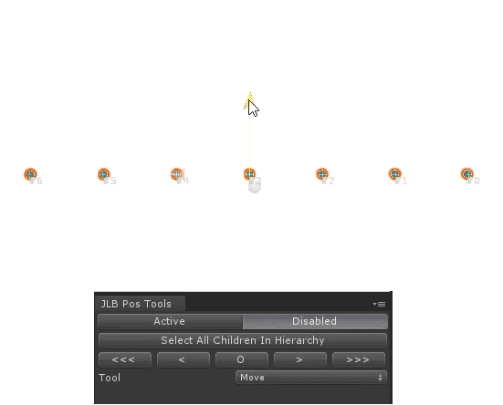
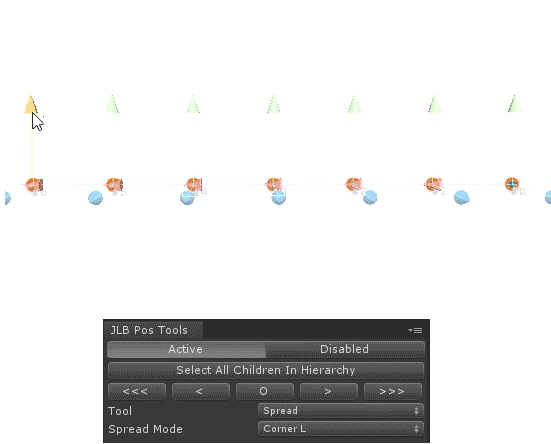
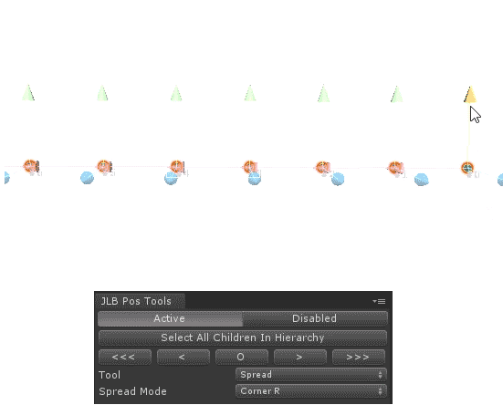
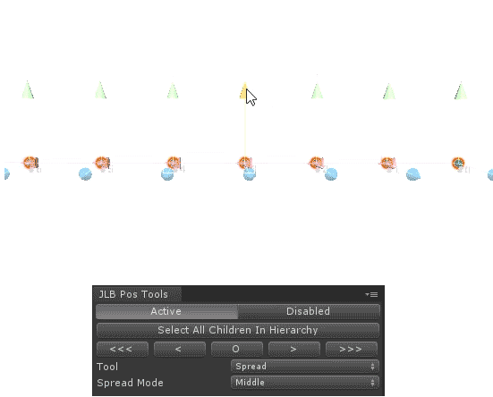
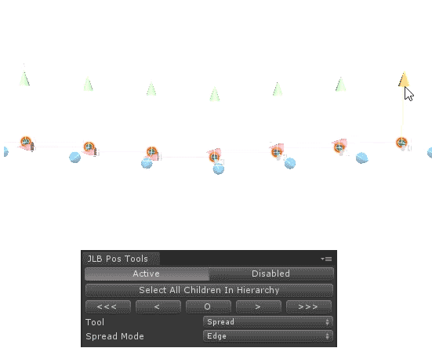
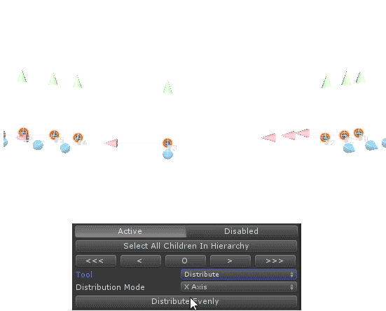
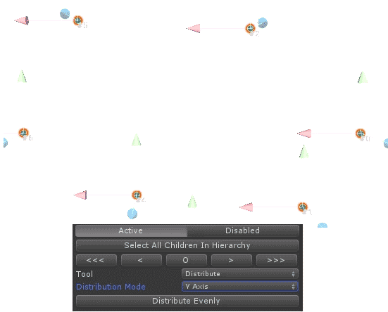
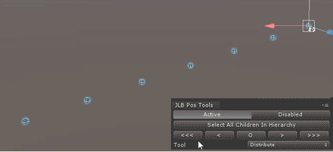

# UnityTransformToolkit
   
A custom transform toolkit made by Joel.   
When selecting any object, the selection order *DOES* matter. There is a handy little button called "Select All Children In Hierarchy" which will select the child objects in the parent selected in the order that it sits in the inspector hierarchy.   
   
Although most of the examples here only show the transformation of GameObjects being manipulated, it is worth nothing that this toolkit also allows for Rotation manipulation
   
### Move   
With the toolkit "Active" you are able to move each item within the selection individually. If you have a selection and Disable the toolkit then you are able to move the entire group together.   
   

  

   
### Spread   
There are 4 different spread options to choose from. All spreads work with both even and odd selections.   

#### Left Corner   
CornerL will allow you to pull the left corner, with the right corner pinned.   

  

   
#### Right Corner
CornerR will allow you to pull the right corner, with the left corner pinned.   

  

   
#### Middle   
Middle will allow you to pull the middle, with the outer corners pinned.   

  

   
#### Edge   
Edge will allow you to pull the outer corners, with the middle pinned.   

  

   
### Distribute   
The distribute functions will distribute between the first and last items in the list. A purple line will be shown from the first to last object to help you see in which direction the items will be distrubted.
#### Across Line   
##### Axis Control   
You are able to distribute your selection evenly along any axis: X, Y, Z, or all three.   

  

  

   
#### Across Area

### Selection   
You have 5 buttons which allow you to scroll through a selection. This is handy when paired to the move tool. Each item within a selection has a number by it to show you where abouts it is in the list of items that you have selected.

  

## To Add

* Distribute across 2 point area
* Add distrubtion single axis rotation distrubition
* Add undo to unity's undo stack 
* Save custom user defined selections
* Quick Selection tools (grouping, offset - I.e. select 2 gameobjects in selection every 5 objects)
* Add invert one of the axis on edge (mirror)